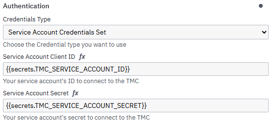
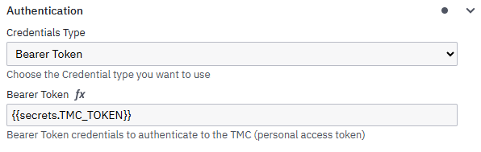
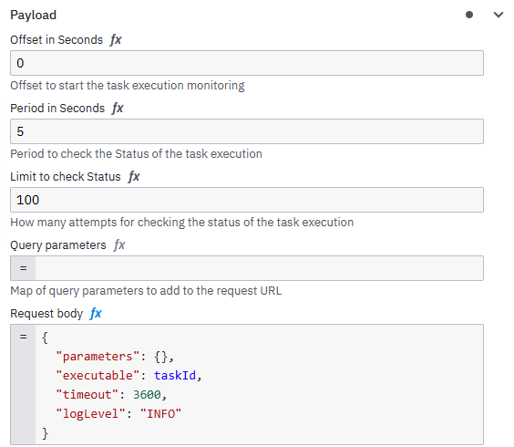
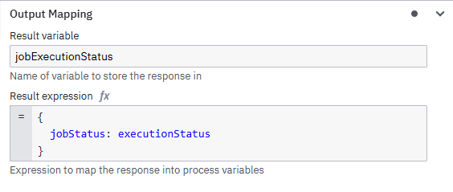
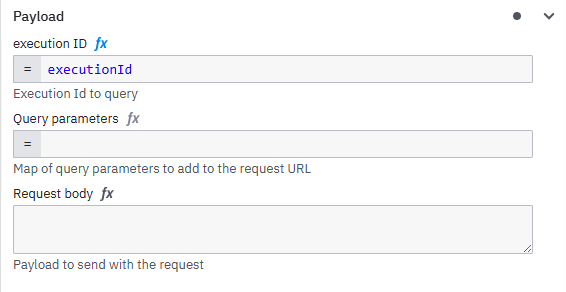
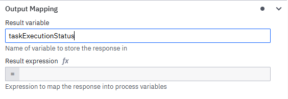
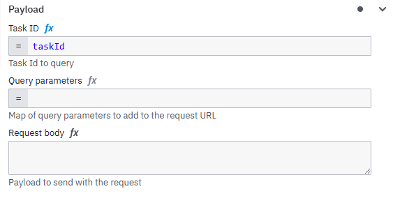

# qlik-tmc-camunda-connector
The Qlik TMC Camunda Connector enables the orchestration of data integration tasks in the Talend Management Cloud (TMC) directly from Camunda processes.

By combining **data pipeline execution** with **process orchestration**, this connector allows you to seamlessly integrate data workflows into your business processes. Tasks defined in TMC can be discovered, executed, monitored, and controlled within a Camunda BPMN model.

This enables use cases such as:
- orchestrating data pipelines as part of business processes
- automating data integration workflows
- monitoring and reacting to task execution results
- handling errors and triggering follow-up actions based on execution status

The connector abstracts the complexity of the TMC APIs and provides a simplified, operation-based interface that can be configured directly within Camunda service tasks.

Each operation corresponds to a specific TMC API capability (e.g., retrieving tasks, executing tasks, monitoring executions), allowing process modelers to build powerful integrations without dealing with low-level API details.

This approach combines the strengths of both platforms:

- **Talend Management Cloud** for data integration and pipeline execution
- **Camunda** for workflow orchestration and process automation

Together, they enable robust, event-driven, and scalable data-driven process automation.

## Authentication

To use this connector, you must provide valid credentials to authenticate against TMC.

The connector supports the following authentication methods:
- Service Account
- Bearer Token (TMC Personal Access Token)

### Service Account

**This Authentication method is currently in BETA**

The Service Account authentication flow is used to connect to TMC using a service account.
Follow this guide to create a service account: [Create a Service Account](https://talend.qlik.dev/use-cases/service-accounts/creating-a-service-account/).

To configure this authentication methode, provide:
- Service Account ID
- Service Account Secret



The connector uses the provided credentials to request an authentication token from TMC.
This token is then used to authenticate all subsequent API requests.

For operations that involve multiple requests (such as Execute Task), the authentication token is reused.
This means authentication is performed only once per connector execution.

### Bearer Token (TMC Personal Access Token)

The Bearer Token authentication method uses a bearer Token to authenticate TMC requests. 
This method allows to authenticate requests using a personal access token.



Follow this guide to create your own personal access token: [Generating a Personal Access Token](https://help.qlik.com/talend/en-US/management-console-with-pipeline-designer/Cloud/cloud-access-token)

Using a personal access token within the bearer token authentication flow means Task executions are performed under the user account associated with the token.

## Task Connector Operations

This connector provides multiple operations that allow interaction with the TMC APIs.
Each operation represents a specific API action, such as retrieving available tasks, starting a task execution, or checking the status of a running execution.

When configuring the connector in a service task, the desired operation can be selected in the Endpoint section of the connector configuration.
After selecting an operation, the configuration fields (such as payload parameters) are automatically adjusted to match the requirements of the chosen operation.

This allows the connector to support multiple TMC API functionalities within a single connector while keeping the configuration simple and operation-specific.

### Available Operations

The connector provides several operations to interact with the TMC APIs. Each operation can be selected in the **Endpoint** section when configuring the connector in a service task.

| Operation                         | Description                                                                                                  |
|-----------------------------------|--------------------------------------------------------------------------------------------------------------|
| **Get Available Tasks**           | Retrieves a list of available tasks with metadata. Tasks can be filtered using optional query parameters.    |
| **Execute Task**                  | Executes a task and waits for the task termination                                                           |
| **Get Task by ID**                | Retrieves detailed metadata and configuration information for a specific task using its `taskId`.            |
| **Get Task Executions**           | Retrieves execution history for a specific task. Supports filtering by time range and execution status.      |
| **Get Available Task Executions** | Retrieves executions across all tasks with optional filters such as workspace, environment, status, or tags. |
| **Get Task Execution Status**     | Retrieves the current status and metadata of a specific task execution using an `executionId`.               |
| **Terminate Task Execution**      | Forcefully stops a running task execution using its `executionId`.                                           |

### Get Available Tasks

Retrieve a list of available tasks from TMC based on optional query parameters.

This operation allows users to search and filter tasks and returns metadata about each available task.

- Queries available tasks from the TMC API
- Supports filtering using multiple optional query parameters
- Returns a list of tasks including metadata
- can be used to dynamically determine executable tasks in a workflow
- for more details see the [TMC API Definition](https://talend.qlik.dev/apis/orchestration/2021-03/#operation_get-available-tasks)

#### Payload

Customize the **Get Available Tasks** operation with additional _optional_ **query parameters** in the **Payload** section.
All parameters are optional and correspond directly to the parameters of the TMC API.

````json
{
  "environmentId": "string (optional)",
  "name": "string - (optional)",
  "artifactId": "string - (optional)",
  "offset": "integer - (optional)",
  "runtimeRunProfileId": "string - (optional)",
  "runtimeType": "string Enum (optional)",
  "workspaceId": "string (optional)",
  "limit": "integer - (optional)",
  "runtimeId": "string - (optional)"
}
````

#### Output / Result

The Operation returns a [PageTask](https://talend.qlik.dev/apis/orchestration/2021-03/#type_pagetask) object
- contains paging metadata which can be used to retrieve large result sets in multiple requests
- contains a list of [items](https://talend.qlik.dev/apis/orchestration/2021-03/#type_taskextract) representing the available tasks
- each item has metadata describing the task:
  - **executable** - the unique task identifier 
  - **artifactId** - identifier of the artifact the task belongs to
  - **name** - name of the task
  - **workspace information**  workspace the task is located in
  - **runtime information** - runtime environment to execute the task

A common use case is retrieving the taskId of a task by its name in order to execute the task. 

You can use the following example as _Result expression_ in the output section to extract the taskId:

````FEEL
{
  taskId: items[1].executable
}
````

#### Error

If the operation fails during execution, the connector throws the following BPMN Errors which can be handled using boundary error events in the process model. 

| Error Code                    | Description / Cause                                                |
|-------------------------------|--------------------------------------------------------------------|
| TMC_INVALID_ARGUMENTS_ERROR   | Invalid user input (id not found, wrong authentication)            |
| TMC_RESPONSE_ERROR            | TMC Request wasnt successful and TMC answered with error HTTP Code |
| TMC_CONNECTION_FAILED         | Connection to the TMC failed                                       |
| TMC_TECHNICAL_ERROR           | technical error                                                    |

### Execute Task

Execute a task in TMC and monitor its execution until completion.
This operation starts a task execution and periodically checks the execution status until the task finishes.

Key behavior:
- Executes a task using its executable (taskId)
- Automatically monitors the execution status
- Configurable offset, polling period,and retry limit for status checks
- Throws a BPMN error if the execution is unsuccessful
- If the connector task is retried, the last execution if the given executable will be monitored

- for more details see the [TMC API Definition](https://talend.qlik.dev/apis/processing/2021-03/#operation_execute-task)

#### Payload

The Execute Task operation can be configured using parameters in the Payload section. The payload must be provided as a request body using an [ExecutableTask](https://talend.qlik.dev/apis/processing/2021-03/#type_executabletask) object.
All parameters are optional and correspond directly to the parameters of the TMC API and need to be modeled as request body.



Example Payload:

````json
{
  "executable": "string (Required)",
  "parameters": "object (Optional)",
  "logLevel": "string (Optional)",
  "timeout": "integer (Optional"
}
````

Execution Monitoring Configuration:
- Offset in Seconds - Offset to start the task execution monitoring (Default: 60)
- Period in Seconds - Period to check the Status of the task execution (Default: 60)
- Limit to check Status - How many attempts for checking the status of the task execution (Default: 100)
These parameters control how long and how often the connector polls the execution status.

#### Output 

The operation returns a [JobExecutionStatus](https://talend.qlik.dev/apis/processing/2021-03/#type_jobexecutionstatusv21) object contain metadata about the execution.

The response includes information such as:
- executionId - unique identifier of the execution
- executionStatus - current status of the execution
- startTimestamp / finishTimestamp - start and end time of the execution
- triggerTimestamp - timestamp when the execution was triggered
- userId - identifier of the user who triggered the execution
- workspaceId - workspace of the artifact and task
- processing statistics
  - numberOfProcessedRows
  - numberOfRejectedRows
- error information
  - errorType
  - errorMessage

You can use the execution result to check if the execution was successful or not. For this you can use an Output Mapping as such:



Use a FEEL expression to check if the execution was successful in a Gateway:

````FEEL
executionStatus = "EXECUTION_SUCCESS"
````

Check the [API documentation](https://talend.qlik.dev/apis/processing/2021-03/#type_jobexecutionstatusv21) for more execution states.

#### Error

| Error Code                     | Description / Cause                                                |
|--------------------------------|--------------------------------------------------------------------|
| TASK_EXECUTION_DISCONNECTED    | Detaching the monitoring due to exceeding the retry limit          |
| TMC_INVALID_ARGUMENTS_ERROR    | Invalid user input (id not found, wrong authentication)            |
| TMC_RESPONSE_ERROR             | TMC Request wasnt successful and TMC answered with error HTTP Code |
| TMC_CONNECTION_FAILED          | Connection to the TMC failed                                       |
| TMC_TECHNICAL_ERROR            | technical error                                                    |

### Get Task Execution Status

Retrieve the current execution status of a task using its executionId.

This operation allows users to monitor the execution of a task and retrieve additional metadata about the execution.

It can be used to obtain information such as:
- current execution status
- potential errors messages
- timestamps of the execution
- runtime information
- additional metadata related to the task execution

#### Payload

To retrieve information about the task execution the user needs to provide an executionId in the **Payload** section.
If the executionId is evaluated dynamically you can use dynamic FEEL expression.



Query parameter and a request body are not necessary to provide.

#### Output

The operation returns a [JobExecutionStatus](https://talend.qlik.dev/apis/processing/2021-03/#type_jobexecutionstatusv21) object contain metadata about the execution.

The response includes information such as:
- executionId - unique identifier of the execution
- executionStatus - current status of the execution
- startTimestamp / finishTimestamp - start and end time of the execution
- triggerTimestamp - timestamp when the execution was triggered
- userId - identifier of the user who triggered the execution
- workspaceId - workspace of the artifact and task
- processing statistics
  - numberOfProcessedRows
  - numberOfRejectedRows
- error information
  - errorType
  - errorMessage

You can use the execution result to check if the execution was successful or not. For this you can use an Output Mapping as such:


Use a FEEL expression to check if the execution was successful in a Gateway:
````FEEL
executionStatus = "EXECUTION_SUCCESS"
````

Check the [API documentation](https://talend.qlik.dev/apis/processing/2021-03/#type_jobexecutionstatusv21) for more execution states.

#### Error

If the operation fails during execution, the connector throws the following BPMN Errors which can be handled using boundary error events in the process model.

| Error Code                      | Description / Cause                                                  |
|---------------------------------|----------------------------------------------------------------------|
| TMC_INVALID_ARGUMENTS_ERROR     | Invalid user input (id not found, wrong authentication)              |
| TMC_RESPONSE_ERROR              | TMC Request wasnt successful and TMC answered with error HTTP Code   |
| TMC_CONNECTION_FAILED           | Connection to the TMC failed                                         |
| TMC_TECHNICAL_ERROR             | technical error                                                      |

### Get Available Tasks Executions

Get available task executions across all tasks.

This operation allows users to query task executions using optional filters. It is useful for monoitoring task activity, identifying failed executions, or analyzing execution history.

Executions can be filtered by:
- environment - restrict results to a specific environment
- workspace - restrict results to a specific workspace
- execution status
- tags associated with tasks
- time range

For a detailed documentation see the [TMC API definition](https://talend.qlik.dev/apis/processing/2021-03/#operation_get-available-task-executions)

#### Payload

The **Get Available Task Executions** operation can be configured using parameters in the Payload section. 
All parameters are optional and correspond directly to the parameters of the TMC API.
The parameters must be provided in the request body as a [TaskExectionsFilters](https://talend.qlik.dev/apis/processing/2021-03/#type_taskexecutionsfilters) object.

Example structure:

````json
{
  "environmentId": "string (Optional)",
  "workspaceId": "string (Optional)",
  "status": "string Enum (Optional)",
  "tags": "array of string (Optional)",
  "lastDays": "integer (Optional)",
  "from": "integer (Optional)",
  "to": "integer (Optional)",
  "limit": "integer (Optional)",
  "offset": "integer (Optional)"
}
````

**Note**

| When neither the number of days nor a datetime period is provided, the default 60 days time range is applied. |
|---------------------------------------------------------------------------------------------------------------|

#### Output

The operation returns a [PageTaskExecutionStatus](https://talend.qlik.dev/apis/processing/2021-03/#type_pagetaskexecutionstatus) object.
The response contains:
- paging metadata which can be used to retrieve large result sets in multiple requests
- a list of [items](https://talend.qlik.dev/apis/processing/2021-03/#type_taskexecutionstatus) representing the available executions
- each item has metadata describing the execution:
  - **taskId** - the unique task identifier of the execution
  - **executionId** - the unique identifier of the execution
  - **taskVersion** - version of the executed task
  - **executionType** - type of the execution (manual, scheduled, webhook, plan)
  - **userId** - user who triggered or scheduled the execution
  - **userType** - Type of  user who triggered or scheduled the execution (HUMAN, SERVICE)
  - **status** - status of the execution
  - **errorMessage** - Error message if an error occurs
  - **runtime information** - runtime environment to execute the task (as an object)

A common use case is retrieving execution information for monitoring or troubleshooting task executions.

The results can be filtered or analyzed in the process using FEEL expression.



Example filters

````FEEL
# filter for non successful executions
taskExecutionStatus.items[i.executionStatus != "EXECUTION_SUCCESS"]

# get errorMessages of unsuccessful executions
taskExecutionStatus.items[i.executionStatus != "EXECUTION_SUCCESS"].errorMessage

# filter for executions of a specific task
taskExecutionStatus.items[i.taskId = id]
````

#### Error

If the operation fails during execution, the connector throws the following BPMN Errors which can be handled using 
boundary error events in the process model.

| Error Code                      | Description / Cause                                                |
|---------------------------------|--------------------------------------------------------------------|
| TMC_INVALID_ARGUMENTS_ERROR     | Invalid user input (id not found, wrong authentication)            |
| TMC_RESPONSE_ERROR              | TMC Request wasnt successful and TMC answered with error HTTP Code |
| TMC_CONNECTION_FAILED           | Connection to the TMC failed                                       |
| TMC_TECHNICAL_ERROR             | technical error                                                    |

### Get Task Executions

Retrieve executions of a specific task.

This operation allows users to query executions and the execution history of a single task using optional filters. 

This operation can be used to:
- check scheduled task runs against maintenance timetables
- Monitor a specific task
- Live monitoring of a task run
- Fetching Executions periodically for analysis
- Troubleshooting an erroneous task

Executions can be filtered by:
- from - start date of the filter period
- to - end date of the filter period
- lastDays - Number of days in the past
- status - execution status

For a detailed documentation see the [TMC API definition](https://talend.qlik.dev/apis/processing/2021-03/#operation_get-task-executions)

#### Payload

The **Get Task Executions** operation can be configured using parameters in the Payload section.
All parameters are optional and correspond directly to the parameters of the TMC API and must be provided as _query parameters_.

Required parameter:
- taskId – identifier of the task whose executions should be retrieved

To retrieve execution of a specific task a taskId must be provided in the **Payload** section.
If the taskId is evaluated dynamically you can use dynamic FEEL expression.


Optional parameters allowing filtering the execution history and controlling pagination of the result set:

````json
{
  "from": "integer (Optional)",
  "offset": "integer (Optional)",
  "to": "integer (Optional)",
  "limit": "integer (Optional)",
  "status": "string Enum (Optional)",
  "lastDays": "integer (Optional) [1-60 Range]"
}
````

#### Output

The **Get Task Executions** operation returns a [PageTaskExecutionStatus](https://talend.qlik.dev/apis/processing/2021-03/#type_pagetaskexecutionstatus) object.
The response contains:
- paging metadata which can be used to retrieve large result sets in multiple requests
- a list of [items](https://talend.qlik.dev/apis/processing/2021-03/#type_taskexecutionstatus) representing the available executions 

Each item has metadata describing the execution:
- **taskId** - the unique task identifier of the execution
- **executionId** - the unique identifier of the execution
- **taskVersion** - version of the executed task
- **executionType** - type of the execution (manual, scheduled, webhook, plan)
- **userId** - user who triggered or scheduled the execution
- **userType** - Type of  user who triggered or scheduled the execution (HUMAN, SERVICE)
- **status** - status of the execution
- **errorMessage** - Error message if an error occurs
- **runtime information** - runtime environment to execute the task (as an object)

A common use case is retrieving execution information for monitoring or troubleshooting task executions.

The results can be filtered or analyzed in the process using FEEL expression.


Example filters

````FEEL
# filter for non successful executions
taskExecutionStatus.items[i.executionStatus != "EXECUTION_SUCCESS"]

# get errorMessages of unsuccessful executions
taskExecutionStatus.items[i.executionStatus != "EXECUTION_SUCCESS"].errorMessage

# filter for executions of a specific task
taskExecutionStatus.items[i.taskId = id]
````

#### Error

| Error Code                  | Description / Cause                                                |
|-----------------------------|--------------------------------------------------------------------|
| TMC_INVALID_ARGUMENTS_ERROR | Invalid user input (id not found, wrong authentication)            |
| TMC_RESPONSE_ERROR          | TMC Request wasnt successful and TMC answered with error HTTP Code |
| TMC_CONNECTION_FAILED       | Connection to the TMC failed                                       |
| TMC_TECHNICAL_ERROR         | technical error                                                    |

### Get Task by ID

Retrieve detailed information about a specific task using its taskId.

This operation allows users to retrieve a task with all its attributes and metadata. It can be used to inspect the configuration and retrieve metadata about a task.

For a detailed documentation see the [TMC API definition](https://talend.qlik.dev/apis/orchestration/2021-03/#operation_get-task-by-id)

#### Payload

To retrieve the task the user needs to provide a taskId in the **Payload** section.
If the taskId is evaluated dynamically you can use dynamic FEEL expression.



#### Output

The operation returns a [TaskV21](https://talend.qlik.dev/apis/orchestration/2021-03/#type_taskv21) object.
The response contains:
- id - unique identifier of the task
- name - name of the task
- description - task description
- artifact - Data about the artifact
- version - task version
- tags - array of tags attached to the task
- parameters - Key value parameter to configure a task execution run

Typical use cases include:
- retrieving metadata about a task
- validating task configuration before execution
- inspecting artifact and runtime configuration

#### Error

| Error Code                     | Description / Cause                                                |
|--------------------------------|--------------------------------------------------------------------|
| TMC_INVALID_ARGUMENTS_ERROR    | Invalid user input (id not found, wrong authentication)            |
| TMC_RESPONSE_ERROR             | TMC Request wasnt successful and TMC answered with error HTTP Code |
| TMC_CONNECTION_FAILED          | Connection to the TMC failed                                       |
| TMC_TECHNICAL_ERROR            | technical error                                                    |

### Terminate Task Execution

The **Terminate Task Execution** forcefully stops a runing task execution.

This operation can be used to stop a running task execution when domain-specific errors occur or when a termination is triggered by another service or process event.

For a detailed documentation see the [TMC API definition](https://talend.qlik.dev/apis/processing/2021-03/#operation_terminate-task-execution)

#### Payload

To stop an execution the user needs to provide an executionId in the **Payload** section.
If the executionId is evaluated dynamically you can use dynamic FEEL expression.


No additional query parameters or request body fields are required.

#### Output

The connector task completes without producing output variables.

#### Error

| Error Code                   | Description / Cause                                                |
|------------------------------|--------------------------------------------------------------------|
| TMC_INVALID_ARGUMENTS_ERROR  | Invalid user input (id not found, wrong authentication)            |
| TMC_RESPONSE_ERROR           | TMC Request wasnt successful and TMC answered with error HTTP Code |
| TMC_CONNECTION_FAILED        | Connection to the TMC failed                                       |
| TMC_TECHNICAL_ERROR          | technical error                                                    |

## Developer Guide - getting started

### TMC API Model

This connector is establishing a connection to the TMC. To call the TMC API the connector is using the official openAPI specification to generate the API model:
The specifications can be found here:

- [processing API spec](src/main/resources/processing-tmc-swagger.json)
- [orchestration API spec](src/main/resources/orchestration-tmc-swagger.json)

This api spec can be found at in the [official TMC documentation](https://talend.qlik.dev/apis/processing/2021-03/swagger20.json).

The API model within the maven lifecycle. If you ever need to adjust the API model, download the swagger-configuration and run ``mvn clean compile``

### application.yaml

To develop and run the connector locally you need to configure the connector. 
The following are the basic configuration you have to provide to run the connector and connect to the SaaS Camunda Platform.
The configuration are supposed to be provided in an ``application.yaml``. This ``application.yaml`` should be placed under the [test resources](src/test/resources). 
This file is included into the [.gitignore](.gitignore) to prevent leaking secrets.

````yaml
camunda:
  client:
    mode: saas
    auth:
      client-id: {{your_client_id}}
      client-secret: {{your_client_secret}}
    cloud:
      cluster-id: {{your_cluster_id}}
      region: {{your_region}}
````

To run the integration tests you can provide following additional configurations:

````yaml
tmc:
  access-token: {{your_personal_access_token}}
  environment-id: {{your_tmc_environment_id}}
  task:
    name: {{task_name}}
    id: {{task_id}}
    execution-id: {{execution_id}}
````

To see the debug logs you can provide the following configuration:

````yaml
logging:
  level:
    root: INFO
    io:
      camunda:
        connector: DEBUG
````

### Start the TMC Connector

To start the TMC Connector you need to start the [Local Connector Runtime](src/test/java/io/camunda/connector/LocalConnectorRuntime.java). This will start the Spring Boot Application.